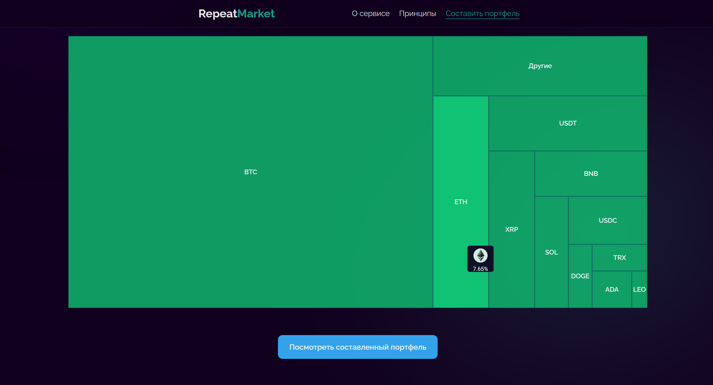
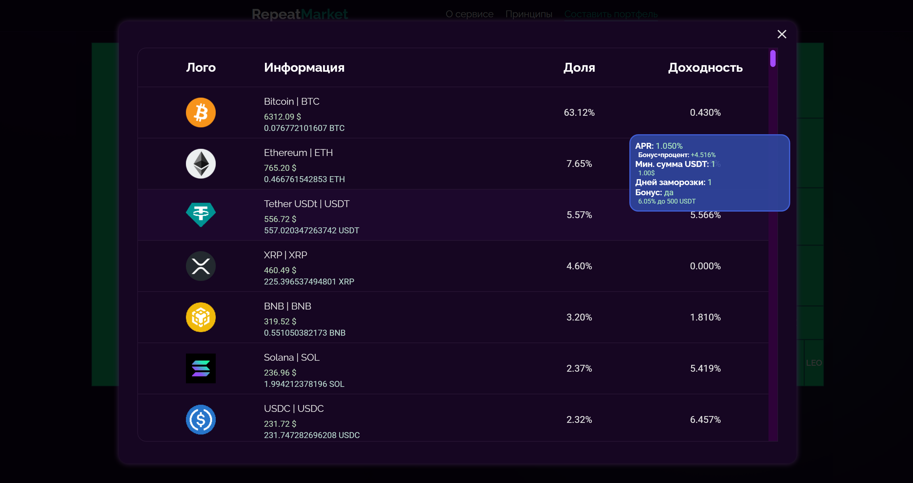

# RepeatMarket

Проект можно заценить тут: http://45.155.207.9:9002/

Данный сайт представляет из себя сервис по автоматическому составлению криптопортфеля, который повторяет рынок. Пользователь может фильтровать монеты: убрать мемкоины, стейболкоины и т.д.

Это пет-проект, в котором я развиваю новые навыки: **prettier, Jest, Webpack**, и прокачиваюсь в **TypeScript, Redux, React**.

Автор: Замахов Егор
